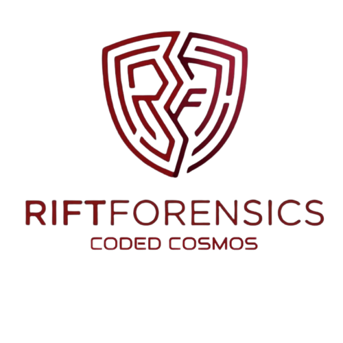

<div align="center">



# 🛡️ RIFT Forensics Engine
### *Next-Generation Money Muling & AML Detection Network*

[](https://rift-forensic-pwioii.vercel.app/)
[](https://github.com/MuntazBegum/rift-forensic-pwioii/)
[](https://opensource.org/licenses/MIT) 
[]() []()[]() []() []() []()  []() []()


<br>

> **🏆 RIFT 2026 Hackathon · Deep Graph Analytics / RegTech Track 🏆**
> 
> *An enterprise-grade, high-throughput topological intelligence system engineered to autonomously untangle multi-layered financial crime and fraud syndicates.*

<br>
</div>

---

## ⚡ The Challenge & The RIFT Solution

**The Crisis:** Global financial institutions hemorrhage trillions of dollars annually to increasingly sophisticated, obfuscated money laundering networks. Traditional rules-based Anti-Money Laundering (AML) systems are plagued by catastrophic false-positive rates and fundamentally fail to detect non-linear, multi-hop syndicates.

**The Solution:** We engineered the **RIFT Forensics Engine**—a real-time, high-throughput RegTech platform that ingests massive, unstructured transactional datasets and transforms them into actionable topological intelligence. By leveraging deep graph-theoretic algorithms and vectorized memory processing, the engine autonomously detects cyclic layering, fan-in/fan-out smurfing, and shadow shell networks in **sub-30-second execution windows**.

---

## 🛠️ Enterprise Tech Stack & Infrastructure

Our microservices-oriented architecture operates on a highly optimized, stateless modern stack designed for rapid horizontal scalability, zero data-persistence bottlenecks, and extreme graphical fidelity.

| Domain | Core Technologies | Strategic Purpose |
| :--- | :--- | :--- |
| 🎨 **Frontend & WebGL** | []() []() | Powers a lightning-fast virtual DOM and GPU-accelerated WebGL spatial rendering capable of mapping tens of thousands of vertices in a force-directed topology without frame drops. |
| 🧠 **Backend Core API** | []() []() | Ultra-low-latency asynchronous API layer built on Starlette, ensuring maximum I/O throughput for massive data ingestion and real-time response. |
| 📊 **Deep Analytics** | []() []() | Vectorized, in-memory tensor processing for instantaneous tabular-to-graph data restructuring and complex network heuristic computations. |
| ☁️ **Cloud DevOps** | []() []() | Fully automated CI/CD pipelines deploying to Vercel's Global Edge Network for UI, and Render's scalable containerized compute instances for the backend. |

---

## 🧬 Algorithmic Core & Graph Theory

Our detection engine goes far beyond simple degree thresholds, executing multi-variate structural analysis on the transactional topology:

* 🌐 **Multi-Dimensional Topological Ingestion:** Raw transactional ledgers are immediately mapped into a highly optimized Directed Graph. Unique financial entities are instantiated as weighted vertices, while transactional vectors become directed edges.
* 🌀 **Deep Cycle Enumeration (Layering Detection):** To dismantle the "layering" phase of money laundering, we implemented an optimized depth-first search protocol targeting elementary cycles of lengths **3, 4, and 5**. 
* 🕸️ **Structural Smurfing Identification:** The engine analyzes asymmetric vertex degrees to expose critical placement and integration hubs within microseconds (*Aggregation mules vs. Dispersal distributors*).
* 🛡️ **Proprietary Temporal Heuristics (Zero-Tolerance FP Filter):** Legacy models notoriously flag legitimate corporate payroll systems. We engineered a filter that identifies super-nodes (`degree > 50`) and forces them through a high-velocity chronological cross-reference algorithm, definitively verifying legitimate corporate bulk processors and neutralizing their threat scores to `0.0`.

<br>

### 🚨 AI-Ready Threat Matrix
Entities are continuously evaluated through a proprietary algorithmic scoring matrix (0–100 threat index):

| Vector Signal | Algorithmic Threat Weight | Impact Level |
| :--- | :--- | :---: |
| **Deep Cycle Participation** | Base +50 (Critical Breach), +10 per overlapping cycle | 🔴 **Critical** |
| **Layered Shell Sub-Graph** | +40 (Identifies obfuscation proxy chains) | 🟠 **High** |
| **Fan-Out (Dispersal)** | +35 (Identifies integration laundering) | 🟡 **Medium** |
| **High Centrality Bridge Node**| +15 (Betweenness Centrality factor > 0.1) | 🟣 **Elevated** |

---

## 🏗️ Decoupled System Architecture

<details>
<summary><b>👁️ Click to view the Data Flow Architecture Diagram</b></summary>
<br>

```text
[ Secure Client Environment ]
   │
   ▼ Multipart Form Data Stream (Encrypted CSV)
┌────────────────────────────────────────────────────────┐
│  Presentation & WebGL Engine (Vercel Global Edge)      │
│  · Client-side Sanitization & State Management         │
│  · Three.js 3D Force-Directed Topology Renderer        │
│  · Dynamic Risk-Matrix Dashboard & SAR Export          │
└──────────────────────────┬─────────────────────────────┘
                           │ Asynchronous POST /analyze
                           ▼
┌────────────────────────────────────────────────────────┐
│  Analytics & ML Heuristics API (Render Cloud Compute)  │
│  · High-Speed Vectorized Normalization (Pandas)        │
│  · Directed Acyclic/Cyclic Graph Generation (NetworkX) │
│  · Sub-Graph Isomorphism & Deep Cycle Enumeration      │
│  · O(1) Look-up Temporal Heuristic Filtering Engine    │
└────────────────────────────────────────────────────────┘

```

</details>

---

## 🚀 Local Deployment Guide

To initialize the RIFT pipeline in a local environment, clone the repository and execute the following commands.

### 1. Initialize Backend Compute (Python/FastAPI)

```bash
cd backend
python -m venv venv
source venv/bin/activate  # (On Windows: venv\Scripts\activate)

pip install -r requirements.txt
uvicorn main:app --reload --port 8000

```

### 2. Initialize Edge Visualization (React/Vite)

```bash
cd frontend
npm install
cp .env.example .env      # Ensure VITE_API_URL=[http://127.0.0.1:8000](http://127.0.0.1:8000) is set
npm run dev

```

---

## 👥 The Engineering Team

Behind the architecture is a dedicated team of cross-functional engineers operating at the intersection of Big Data and UX.

| Engineer | Core Responsibility Focus | Domain Expertise |
| --- | --- | --- |
| 👨‍💻 **Mohammed Farhan Ahmed** | **Backend / Algorithm** | Core Algorithmic Mathematics, Fast API Architecture & Threat Scoring Matrix. |
| 👩‍💻 **Muntaz Begum** | **Frontend / Visualization** | WebGL Spatial Visualization, React Presentation Architecture & UI/UX Design. |
| 👩‍💻 **Sneha Bera** | **Data & Testing** | Data Engineering, Vectorized Normalization, Pipeline Stress Testing & QA. |
| 👨‍💻 **Mohammed Ammar Ahmed** | **Deployment & Docs** | Cloud Infrastructure, CI/CD Deployments (Vercel/Render) & Technical Documentation. |

<div align="center">
<i>Engineered with precision for the future of decentralized financial security.</i>
</div>

```

```
